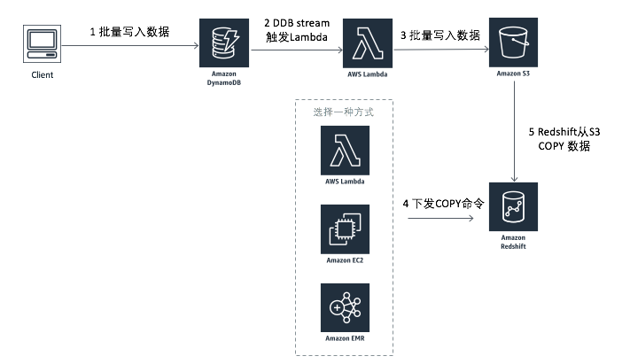

# DynamoDB stream write to Redshift    

(BETA Lab)    
This lab is leverage DynamoDB stream trigger Lambda to write data into Redshift.  
本实验是在数据持续写入 DynamoDB 的情况下，以 DynamoDB Stream 触发 Lambda，Lambda 获取Stream的数据，并写入 S3。然后 Redshift 从 S3 中加载数据。控制 Redshift 加载的命令可以选择以下4种的其中一种: Lambda被S3触发、Lambda定时触发、EC2定时任务、EMR定时任务合并文件然后下发COPY。选择要根据数据量的大小和频度。  

## DynamoDB 数据写入 S3  

1. 创建 DynamoDB 数据表  
   创建一个表，以 id 为partition key  

2. 创建 Lambda 函数写入 S3  
创建 Lambda 函数，代码为：  
    [Lambda_ddbstream_write_S3.py](./Lambda_ddbstream_write_S3.py)  

替换代码中的 bucket 和 prefix 为你期望写入S3的位置。  

Lambda 配置为运行超时 1 分钟，配置 Lambda 的角色有权限进行：  
* 写 CloudWatchLog
* 读取对应 DynamoDB 表
* 写入 S3 对应 Bucket

3. 配置 DynamoDB 触发 Lambda  
在 Lambda 界面中配置 DynamoDB 触发 Lambda，批处理大小设置为 100 

4. 运行本地 Python 脚本写入数据到 DynamoDB  

批量产生数据写入 DynamoDB，建议配置 DynamoDB 的容量为按需方式。
    [Python 文件 ddb_data_generator.py](./ddb_data_generator.py)  

注意修改 batchnumber 为每批写入的数据量  
请替换文件中的 ddbstream2 为上一步创建的表的表名。  
运行：  

    python ddb_data_generator.py
  
5. 观察  

此时会看到 DynamoDB 有数据记录增加，S3 按每小时一个目录增加了对应的数据文件，每个文件几十Bytes到几KB不等。

## S3 数据加载到 Redshift 

考虑数据量的大小和产生是否均衡来选择合适的下发加载命令的工具，随着数据写入速度增加，可以依次选择：  

1. S3 新增一个文件就触发一个 Lambda 控制 Redshift 做加载  

适合数据量比较小，例如每秒10个消息，或者是不稳定，有时候会突发，但大部分时候数据量不大。参考代码：  

[Lambda_redshift_load_s3-triggerMode.py](./Lambda_redshift_load_s3-triggerMode.py)

Lambda_redshift_load 不应保存 Redshift 数据库的用户名密码，建议采用 Lambda的环境变量，或者采用SSM的ParaMeter Storage集中保存。本例采用SSM。  

Lambda 应能访问 Redshift 所以需要运行在 VPC 模式，配置跟 Redshift 相同的 VPC 中  

Lambda 配置为运行超时 15 分钟，配置 Lambda 的角色有权限进行：  
* 写 CloudWatchLog
* 访问 SSM
  
2. 定时任务触发 Lambda 每小时整点过几分钟，就执行一次加载前一小时的数据  

数据量相对小，加载的过程确保在15分钟之内是可以完成的。参考代码：  

[Lambda_redshift_load_s3-cronMode.py](./Lambda_redshift_load_s3-cronMode.py)

注意事项参考 1
   
3. EC2上跑定时任务  

能够长时间运行，控制Redshift进行定时的数据加载，每小时，或者每天执行一次加载数据

4. 启动EMR，运行S3distcp组件，合并每小时的所有碎片文件数据为一个大的文件  

S3distcp 是EMR上预装的软件，命令举例：

    hadoop jar /usr/share/aws/emr/s3-dist-cp/lib/s3-dist-cp.jar \
    --src s3://emrdata/ddb_stream/2018/01/01/02/ \
    --dest s3://emrdata/ddb_stream_aggregated/ \
    --groupBy ".*/(\\w+)/.*" --targetSize 64

S3distcp 参考文件：https://docs.aws.amazon.com/zh_cn/emr/latest/ReleaseGuide/UsingEMR_s3distcp.html

## 注意  
* Lambda 最长运行时间为 15分钟。虽然Lambda不参与加载的数据流，Lambda下发COPY命令给 Redshift后，Redshift自己去S3 COPY的，但Lambda需要继续运行直到加载结束，否则无法完成数据 commit
* S3中保存的数据文件是碎片式的，所以数据量大的时候建议先进行文件合并，然后再加载。例如使用EMR（S3distcp）进行
* DynamoDB 的 Partition Key 设计应该要分散，不要让大量数据在同一时间写入到同一个 partition，保证其并发写入能力
* 为了减少S3的碎片文件，让 Lambda 能获取更多的 DynamoDB stream的数据之后再写入 S3。这样除了要把Lambda配置DynamoDB的批处理数量为100之外，还可以配置控制 Lambda 的并发数，例如数据流量不大的时候，控制并发为 1。这样所有数据都强迫走同一个 Lambda。
* 注意 Lambda 的运行超时时间的设置，避免运行超时失败的情况。
* 小心 Stream 毒丸。因为 Stream 模式触发Lambda是无限重试的。也就是说如果 DynamoDB 触发 Lambda 处理，处理失败则会一直重试同一个数据，直到数据失效为止，所以代码要特别小心处理所有exception的情况。
* S3 或 CloudWatch 触发Lambda的情况是异步模式，会重试两次，再失败则会进入死信队列（DLQ），请给控制 Redshift 加载数据的那个Lambda配置DLQ，以便出现异常的情况能够通知SNS，或者执行另一个Lambda进行自动化排障处理。

## 延伸
* 以上是对实时写入DDB的数据Stream到S3中，而如果是对存量的大量的DDB数据呢？能否使用Lambda来实现而又避免15分钟超时？以下处理选项是两种可行的方式，主要针对Key能顺序检索的表:
  1. 使用 StepFunction。由StepFunction触发启动Lambda，读取DDB数据的同时在Lambda函数代码中监控运行的时间，超过14分钟，就结束函数并把最后获取到的DDB记录的Key关键字返回 StepFunction ，StepFunction 把Key再重新触发 Lambda 并传入参数 Key，Lambda从这个Key后面开始继续读取。  
  StepFunction 是非常便利的状态机服务，天生高可用，并可设置自动重试和超时等控制
  2. 对于方法1的一个变种，不使用 StepFunction，而使用一个独立的DDB表来做 StepFunction 的工作。Lambda 执行到14分钟就结束并把最后的Key写入到这个独立的DDB，DDB Stream再触发Lambda（自动带上了新写入的Key），Lambda从收到的Key之后继续取DDB的数据